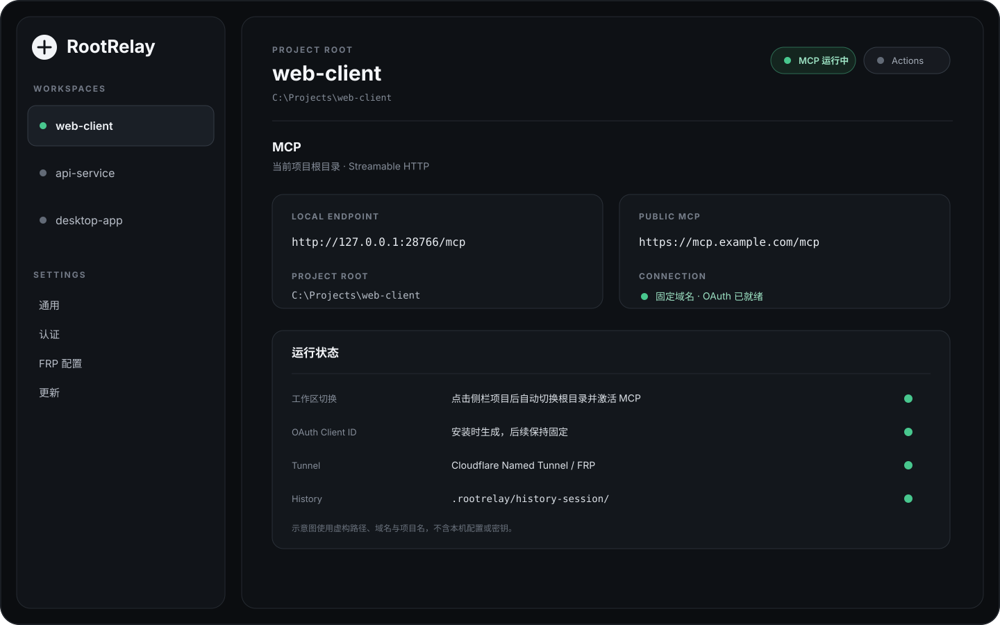

<p align="center">
  
</p>

<h1 align="center">RootRelay</h1>

<p align="center">
  Connect a local workspace to MCP-compatible clients through one stable endpoint.
</p>

<p align="center">
  <a href="README.md">English</a>&nbsp;&nbsp;<a href="README.zh-CN.md">简体中文</a>
</p>

<p align="center">
  <a href="https://github.com/biaroli/RootRelay/releases/latest"></a>
  
  
  
</p>

RootRelay runs an MCP server on your computer and points it at the workspace you choose. A connected client can read and edit files, search the project, run approved commands and tests, inspect Git, view images, and keep project-scoped session history.

The client connection stays stable while the active workspace changes. Import several projects once, then select a project in the sidebar to switch the MCP root and activate it immediately.



The preview uses fictional project names, paths, domains, and credentials.

## About

RootRelay is a desktop MCP workspace relay for local development projects. It keeps one MCP service identity and one client-facing endpoint while letting you switch the project root behind that connection from the desktop UI.

The goal is simple: import your workspaces once, connect an MCP-compatible client once, and move between projects without rebuilding the connection every time. RootRelay handles the local workspace boundary, MCP tools, authentication, tunnel lifecycle, and project-scoped session history around that workflow.

## Why RootRelay

| Area | What RootRelay does |
| --- | --- |
| Workspace | Imports local project folders and switches the active project root from the sidebar |
| MCP | Serves a Streamable HTTP MCP endpoint with file, search, patch, command, Git, image, and history tools |
| Client support | Works with clients that support the MCP transport and authentication mode you configure |
| Remote access | Supports Cloudflare Named Tunnel, Cloudflare Quick Tunnel, FRP, or local-only access |
| Authentication | Supports OAuth, bearer token, or no authentication for local use |
| Stable identity | Keeps one installation-level OAuth Client ID across restarts, workspace switches, and normal app maintenance |
| Session history | Stores project-scoped development history under `.rootrelay/history-session/` |
| Actions gateway | Can expose a separate OpenAPI Actions endpoint when that integration is useful |

## MCP clients

RootRelay is client-agnostic. ChatGPT and Claude are common remote MCP clients, and the same RootRelay endpoint can be used by other MCP-compatible clients when they support Streamable HTTP and the selected authentication mode.

Client products do not all expose the same MCP features or permissions. RootRelay provides the server and tools; the client decides which server capabilities it can use.

## Install

Download the current build from [GitHub Releases](https://github.com/biaroli/RootRelay/releases/latest).

| Platform | Package |
| --- | --- |
| Windows 10/11 x64 | `RootRelay_*_x64-setup.exe` |
| macOS Intel + Apple Silicon | `RootRelay_*_universal.dmg` |

The macOS build is not currently notarized with an Apple Developer certificate. On first launch, macOS may require approval in System Settings → Privacy & Security.

## First setup

### 1. Configure the MCP service

Open General. Choose the local MCP port, permission mode, allowed commands, and the tunnel mode you want to use. Save the configuration once; it is shared by every imported workspace.

For local-only clients, disable the public tunnel and use an endpoint such as:

```text
http://127.0.0.1:28766/mcp
```

### 2. Configure authentication

Open Authentication. OAuth is the recommended choice for a public MCP endpoint.

RootRelay creates one installation-level OAuth Client ID and keeps it stable. The Client ID is read-only in the UI. Authorization credentials and secrets can still be rotated independently.

### 3. Import a workspace

Choose Add workspace and select a project root.

After import, selecting a workspace performs the full switch automatically:

```text
remember selection
→ stop the previous workspace MCP runtime
→ switch the project root
→ activate the selected workspace with the shared configuration
```

There is no second start button after selecting a workspace.

## Remote access

### Cloudflare Named Tunnel

Named Tunnel is the best fit for a long-lived remote connection. Configure a Tunnel Token and a fixed HTTPS hostname such as `https://mcp.example.com`, then give the client:

```text
https://mcp.example.com/mcp
```

The fixed hostname and the fixed OAuth Client ID remain unchanged when you switch projects. RootRelay waits for a replacement tunnel to become ready before retiring the previous connector.

### Cloudflare Quick Tunnel

Quick Tunnel is useful for temporary testing. Its `trycloudflare.com` address may change after a restart, so it is not intended as a permanent client endpoint.

### FRP

If you operate an FRPS server, save the server address, port, and token in FRP Configuration. Then select FRP in General and assign the subdomain used by the MCP service.

## Connect a client

Enter the `/mcp` URL shown by RootRelay into a client that supports custom MCP servers and choose the same authentication mode configured in RootRelay.

A simple first connection check is:

```text
server_info
get_default_cwd
git_status
```

`server_info` confirms the RootRelay service, `get_default_cwd` confirms the active project root, and `git_status` confirms that Git operations are pointed at the expected repository.

## Workspace switching

Ports, authentication, tunnel settings, and execution policy are application-level configuration. The selected workspace supplies the project root.

That separation is what allows a client to keep the same remote URL and OAuth identity while RootRelay changes the project behind the endpoint.

When the app restarts, RootRelay restores the last selected workspace and starts the configured MCP service again.

## Session history

RootRelay can keep development context inside the project:

```text
.rootrelay/history-session/
```

| Tool | Purpose |
| --- | --- |
| `history_session_bootstrap` | Starts or restores the session archive for a conversation |
| `history_session_checkpoint` | Saves decisions, changes, verification, and next actions |
| `history_session_search` | Searches previous session archives |
| `history_session_read` | Reads one archived session |
| `history_session_validate` | Validates archive numbering and the derived index |

RootRelay does not read a remote chat window in the background. History is written only when the MCP client calls the history tools.

## Security

RootRelay can modify files and execute commands inside the selected workspace. Protect public endpoints with authentication and only connect clients you trust.

On Windows, command safety is enforced primarily by RootRelay workspace boundaries and command policy. It should not be treated as a complete operating-system sandbox.

## Development

Maintainer setup and engineering notes are kept in [docs/DEVELOPMENT.md](docs/DEVELOPMENT.md).

## License

RootRelay is licensed under the [Apache License 2.0](LICENSE).

Thanks to [Coding Tools MCP](https://github.com/xyTom/coding-tools-mcp) and its contributors for the early Apache-2.0 code base. Copyright 2026 Coding Tools MCP Contributors.

RootRelay is not affiliated with or endorsed by OpenAI, Anthropic, or Cloudflare.
