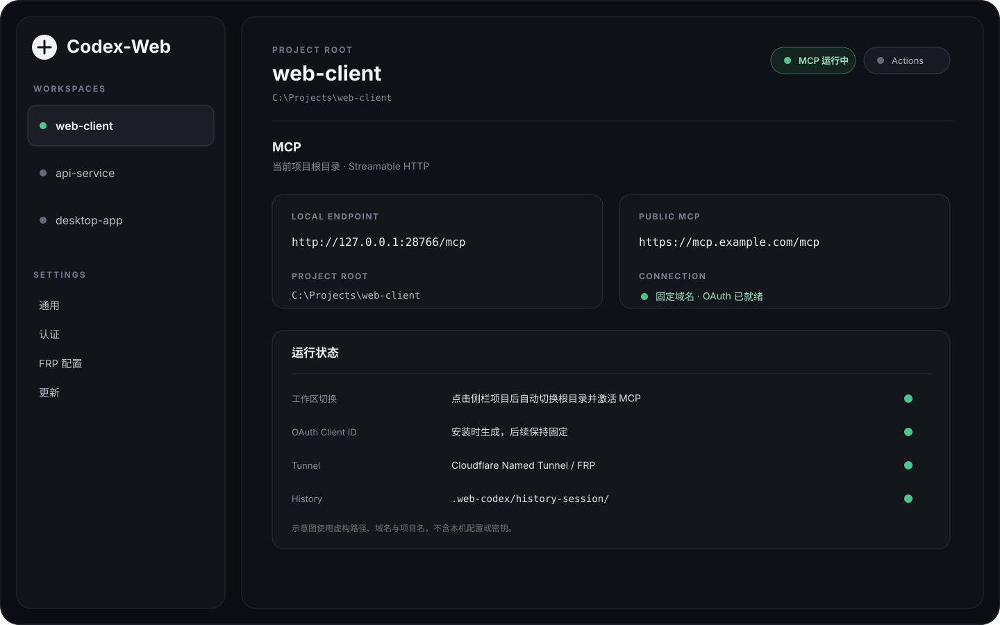

<p align="center">
  
</p>

<h1 align="center">Codex-Web</h1>

<p align="center">
  本地桌面 MCP 工作区管理器。把代码目录接到 ChatGPT、Codex 或其他支持 MCP 的客户端。
</p>

<p align="center">
  <a href="https://github.com/biaroli/Codex-Web/releases/latest"></a>
  
  
  
</p>

Codex-Web 在本机运行 MCP。连接后，客户端可以读写工作区文件、运行命令和测试、检查 Git，并把开发进度写进项目自己的历史会话目录。

端口、认证、隧道和权限策略由应用统一保存。工作区只保存项目根目录。导入多个目录后，点击左侧项目会保存当前选择、停止旧工作区 MCP、切换根目录并激活新工作区。应用重启后会恢复最后一次选择。



> 图中的项目名、路径和域名都是虚构内容，不含本机配置、Token 或其他私密信息。

## 功能

- 多工作区管理，导入目录后从侧栏直接切换。
- MCP Streamable HTTP 服务。
- 文件读取、搜索、事务化 Patch、命令执行、Git、图片查看和历史会话工具。
- GPT Actions OpenAPI 网关，可与 MCP 分开使用。
- OAuth、Bearer Token 和无认证模式。
- OAuth Client ID 首次初始化后固定保存，重启、切换工作区、更新应用和修复组件都不会轮换。
- Cloudflare Quick Tunnel、Cloudflare Named Tunnel 和 FRP。
- `frpc`、`cloudflared` 缺失时自动安装，设置页可以重新修复组件。
- `.web-codex/history-session/` 跨对话开发记录。
- GitHub Release 签名 OTA，应用内检查、下载、验签、安装并重启。

## 安装

从 [Releases](https://github.com/biaroli/Codex-Web/releases/latest) 下载当前版本。

| 系统 | 安装包 |
| --- | --- |
| Windows 10/11 x64 | `Codex-Web_*_x64-setup.exe` |
| macOS Intel + Apple Silicon | `Codex-Web_*_universal.dmg` |

macOS Release 目前没有 Apple Developer 签名和 notarization。首次打开时，macOS 可能要求在“系统设置 → 隐私与安全性”中确认。Tauri updater 的更新签名只负责校验 OTA 文件。

## 第一次配置

### 1. 配置 MCP

打开“通用”。

1. 保留默认本地端口，或改成自己的端口。
2. 选择公网隧道：Cloudflare、FRP，或者关闭公网隧道只在本机使用。
3. 设置 MCP 权限和允许执行的命令。
4. 保存。

这套服务配置对所有工作区生效。新增项目不用重复填写端口、隧道和策略。

### 2. 配置认证

打开“认证”，公网 MCP 推荐使用 OAuth。

Codex-Web 首次初始化时会生成安装级 OAuth Client ID。界面只读显示这个 ID。只要应用数据还在，它就保持不变。

OAuth 页面还会保存授权口令、Token Secret 和可选的 Client Secret。授权口令和 Secret 可以轮换，Client ID 不提供重新生成入口。

### 3. 导入工作区

点击左侧“添加工作区”，选择项目根目录。

导入完成后会直接进入该项目。以后点击任意工作区都会执行：

```text
保存当前选择
→ 停止旧工作区 MCP
→ 切换项目根目录
→ 使用同一套全局配置激活新工作区 MCP
```

不需要选完项目再点一次启动。

## 公网连接

### Cloudflare Named Tunnel

长期连接建议使用 Named Tunnel。固定域名配合固定 OAuth Client ID，可以让客户端一直连接同一个 MCP 地址和同一个 OAuth 身份。

准备：

- Cloudflare Named Tunnel
- Tunnel Token
- 已绑定到该 Tunnel 的固定 HTTPS 域名，例如 `https://mcp.example.com`

在“通用 → MCP 服务”中：

1. 隧道类型选择 `Cloudflare`。
2. Cloudflare 模式选择 `Named Tunnel`。
3. 填固定公网 URL。
4. 填 Tunnel Token。
5. 保存。

客户端使用：

```text
https://mcp.example.com/mcp
```

Codex-Web 会等待新 Tunnel 可用，再处理旧连接。固定域名不会因为 Codex-Web 进程重启而改变。

### Cloudflare Quick Tunnel

Quick Tunnel 适合临时测试。它使用 `trycloudflare.com` 临时域名，重启后地址可能变化。需要长期挂着客户端时使用 Named Tunnel 或 FRP。

### FRP

已有 FRPS 服务端时，在“FRP 配置”中保存服务器、端口和 Token。回到“通用”，把 MCP 隧道切到 FRP，选择服务器并填写子域名。

### 本机连接

关闭公网隧道后，MCP 仍可在本机运行。默认地址类似：

```text
http://127.0.0.1:28766/mcp
```

远程 ChatGPT 无法访问你电脑的 `127.0.0.1`。本机地址给本机 MCP 客户端使用。

## 连接 MCP 客户端

把工作区页面显示的公网 `/mcp` 地址填入支持自定义 MCP 的客户端，并选择和 Codex-Web 一致的认证方式。

首次连接可以调用：

```text
server_info
get_default_cwd
git_status
```

这三个结果能确认 Codex-Web 服务信息、当前项目根目录和仓库状态。

需要跨对话记录时调用：

```text
history_session_bootstrap
```

任务结束后调用 `history_session_checkpoint` 保存本轮进度。

## 工作区切换与固定连接

OAuth Client ID 保存在应用级配置中。Named Tunnel 或 FRP 的公网地址同样属于全局服务配置。工作区只决定当前 MCP 指向哪个项目根目录。

切项目时，客户端继续访问原来的公网地址，OAuth 继续使用原来的 Client ID，后端只更换 MCP 的代码根目录。

开发 Codex-Web 本身时会有短暂断开：`tauri dev` 会监听 Rust 源码，后端文件变化会触发重新编译和进程重启。Release 安装版没有源码 watcher，普通项目修改不会触发这种重启。

## 历史会话

项目可以保存自己的：

```text
.web-codex/history-session/
```

| 工具 | 用途 |
| --- | --- |
| `history_session_bootstrap` | 新对话初始化或恢复当前会话 |
| `history_session_checkpoint` | 保存本轮决策、改动、测试和下一步 |
| `history_session_search` | 搜索旧会话 |
| `history_session_read` | 读取指定历史档案 |
| `history_session_validate` | 检查历史编号和索引 |

历史文件跟着项目走。Codex-Web 不会后台读取远程聊天窗口，只有客户端调用历史工具时才会写入内容。

## 本地开发

需要 Node.js 20+、Rust stable，以及 Tauri 2 对应平台的系统依赖。

```bash
npm install
npm run check
npm run desktop
```

构建桌面安装包：

```bash
npm run desktop:build
```

发布前建议执行：

```bash
npm run check
npm run build

cd src-tauri
cargo check
cargo test
cargo clippy --all-targets -- -D warnings
```

## Release 与 OTA

Tauri 配置位于 `src-tauri/tauri.conf.json`。仓库已开启 updater 构建产物，并把 updater endpoint 指向 GitHub Release 的 `latest.json`。

GitHub 仓库需要配置两个 Actions Secret：

```text
TAURI_SIGNING_PRIVATE_KEY
TAURI_SIGNING_PRIVATE_KEY_PASSWORD
```

私钥必须和 `tauri.conf.json` 中的公钥配对。私钥只放 GitHub Secrets，不提交仓库。

每个 Release 必须上传安装包、updater 文件、`.sig` 和 `latest.json`。客户端检查 `latest.json`；发现更高版本后，可以在“更新”页面完成下载、验签、安装和重启。GitHub Actions 自动化发布时需要把上述两个签名 Secret 传给 Tauri 构建步骤。

版本号发布前要保持一致：

- `package.json`
- `src-tauri/Cargo.toml`
- `src-tauri/tauri.conf.json`

推送版本 tag 即可触发 Release：

```bash
git tag v0.1.1
git push origin v0.1.1
```

## 常见问题

### 客户端突然看不到工具

先看工作区页面的 MCP 状态和公网地址。如果正在开发 Codex-Web 本身，再看终端是否刚触发 Rust watcher 重编译。

### OAuth 重启后又要重新配置

确认客户端保存的是固定域名，并使用“认证”页面显示的固定 OAuth Client ID。Quick Tunnel 临时域名不适合长期 endpoint。

### 切工作区后仍然看到旧项目

调用 `get_default_cwd` 和 `git_status` 检查服务端根目录。侧栏点击会等待后端完成切换后再读取新的运行状态。

### 自动更新失败

打开对应 GitHub Release，检查 updater 文件、`.sig` 和 `latest.json` 是否齐全。签名文件缺失、`latest.json` 指向错误文件、私钥与内置公钥不匹配时，updater 会拒绝安装。

## 项目结构

```text
src/                    SvelteKit 桌面界面
src-tauri/src/          Rust 后端、MCP、认证、Git、命令、隧道与更新
src-tauri/tests/        Rust 集成测试
src-tauri/icons/        桌面应用图标
static/                 前端静态资源与 README 产品预览
.github/workflows/      Windows / macOS Release 流程
```

本机 Token、Tunnel Token、OAuth Secret、工作区列表和当前项目的历史会话不会作为仓库源码发布。

## 安全

Codex-Web 可以修改文件和执行命令。公网部署时开启认证，只连接自己控制或明确可信的客户端。

Windows 当前的命令执行边界主要由 Codex-Web 的工作区限制和命令策略提供，不等同于完整的操作系统级文件沙箱。

## License

Codex-Web 使用 Apache License 2.0，完整许可见 [LICENSE](LICENSE)。

感谢 [Coding Tools MCP](https://github.com/xyTom/coding-tools-mcp) 及其贡献者提供早期 Apache-2.0 代码基础。Copyright 2026 Coding Tools MCP Contributors。

Codex-Web 与 OpenAI、Cloudflare 没有隶属或官方合作关系。
