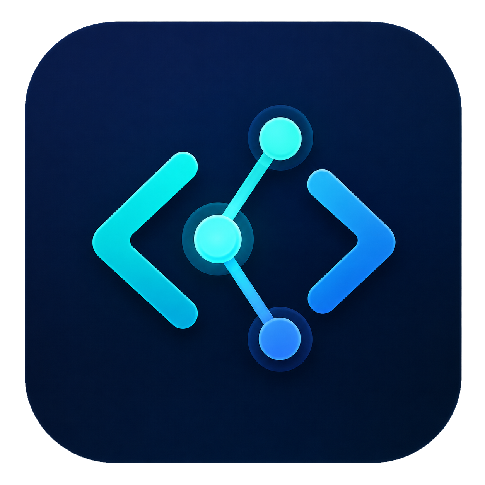
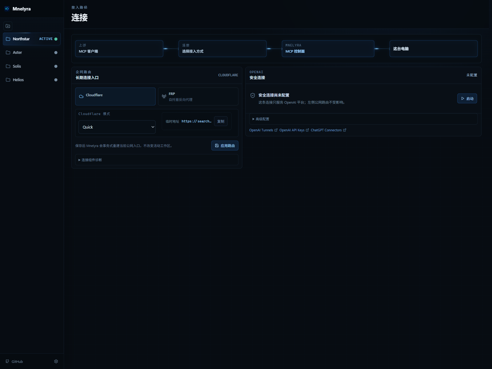
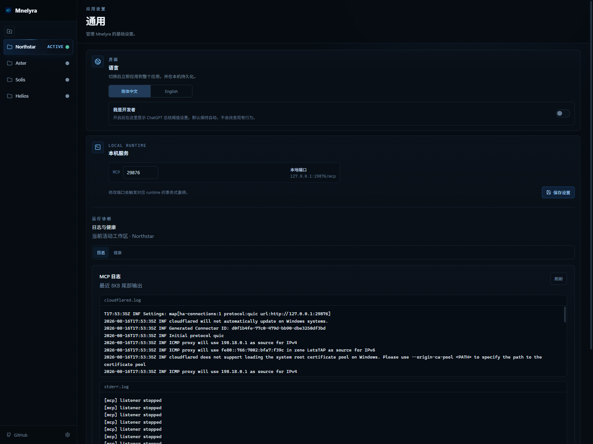
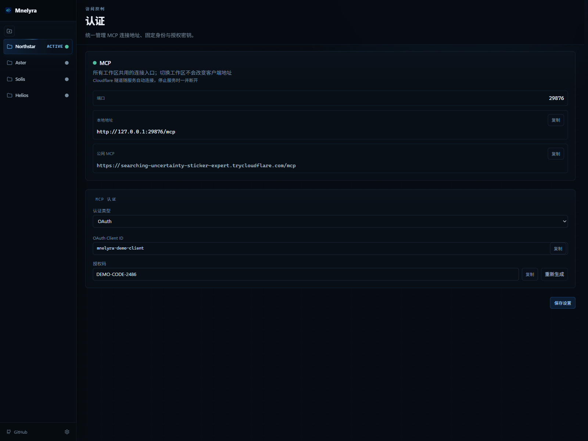
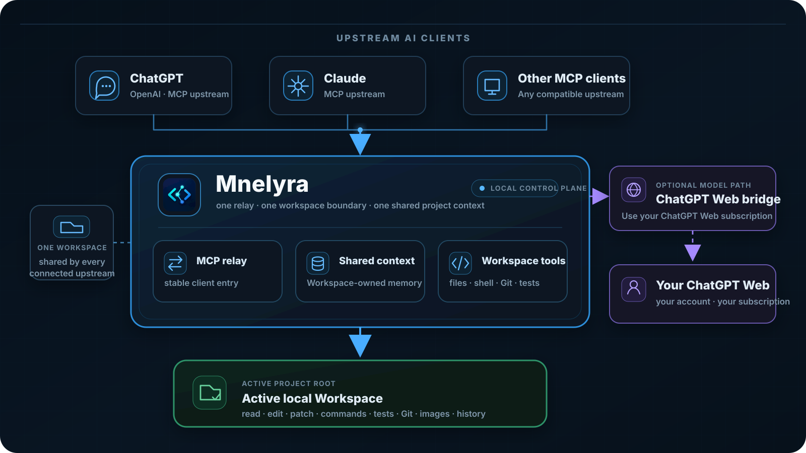

<p align="center">
  
</p>

<h1 align="center">Mnelyra</h1>

<h3 align="center">让 ChatGPT、Claude 和任意 MCP 客户端，共用同一个本地工作区与同一份项目记忆。</h3>

<p align="center">
  <strong>上游可以直接通过 MCP 读写文件、运行命令和测试；还可以把 ChatGPT Web 订阅作为另一条模型通道接进工作流。</strong>
</p>

<p align="center">
  <a href="README.md">English</a>&nbsp;&nbsp;<a href="README.zh-CN.md">简体中文</a>
</p>

<p align="center">
  <a href="https://github.com/biaroli/Mnelyra/releases/latest"></a>
  
  
  
</p>

Mnelyra 把一个真实的本地项目目录变成所有上游 AI 都能共同使用的工作区。ChatGPT、Claude 或其他 MCP 客户端可以直接从网页读取和修改文件、搜索项目、应用 Patch、执行命令和测试、检查 Git、查看图片。

工作区同时也是记忆边界。你可以从一个上游切到另一个上游，开发历史、当前焦点、最近变化和未完成事项仍然跟着项目走，而不是锁死在某个聊天窗口或某一家模型里。



> 所有 README 截图都由当前 Mnelyra production UI 在隔离演示环境中生成。项目名、路径、域名、Client ID、Token 和密钥均为虚构数据，不包含开发者本机内容。

## 为什么用 Mnelyra

| ChatGPT Web 作为额外模型通道 | 一个工作区，共享一份记忆 | 直接操作项目 |
| --- | --- | --- |
| 可选接入 ChatGPT Web bridge，把你自己的 ChatGPT Web 订阅作为另一条模型通道。 | ChatGPT、Claude 和其他 MCP 上游围绕同一个 Workspace 工作，历史与恢复状态跟着项目走。 | 任何兼容 MCP 的上游都可以直接使用 Mnelyra 的文件、命令、Git、测试、图片和历史工具操作工作区。 |

## 功能一览

### 一个入口接所有上游

上游只需要连 Mnelyra。OpenAI 安全连接、Cloudflare 和 FRP 都集中在连接页；工作区切换发生在 Mnelyra 后面，所以不需要每换一个项目就重新配置 ChatGPT、Claude 或其他 MCP 客户端。

### 应用级控制不塞进 Workspace 页面

左侧 Workspace 只负责切换当前项目根目录。共享 MCP 地址与 OAuth/Bearer 授权集中在“认证”，运行日志和健康检查放在“通用”，公网路由仍在“连接”。这些控制应用到所有工作区，不需要每个项目重复配置。



### 固定连接身份

支持 OAuth 和 Bearer Token。OAuth 使用 PKCE；兼容客户端可以自动注册，真正授权前会要求输入 Mnelyra 桌面端显示的授权码。切换项目不需要重新连接客户端。



### 直接改项目

MCP 本身就提供文件读取与修改、搜索、Patch、命令执行、测试、Git、图片和历史工具。当前 Workspace 就是这些工具的项目根目录。

## 工作方式



客户端连接和项目根目录彼此分开。多个项目只需要导入一次，之后从侧栏切换 Workspace；客户端仍然使用原来的 Mnelyra 连接。

## 快速开始

### 1. 安装

从 [GitHub Releases](https://github.com/biaroli/Mnelyra/releases/latest) 下载当前版本。Release 客户端会在启动时检查 GitHub Releases；发现新版本后可直接在应用内完成签名验证、下载和更新。

| 系统 | 安装包 |
| --- | --- |
| Windows 10/11 x64 | `Mnelyra_*_x64-setup.exe` |
| macOS Intel + Apple Silicon | `Mnelyra_*_universal.dmg` |

macOS 当前没有 Apple Developer notarization，首次打开时可能需要在“系统设置 → 隐私与安全性”中确认。

### 2. 添加工作区

点击侧栏的文件夹按钮，选择项目根目录。选择工作区后，Mnelyra 会把 MCP 根目录切到该项目并激活它，不需要第二个启动按钮。

### 3. 选择连接方式

打开 **连接**：

| 场景 | 连接方式 |
| --- | --- |
| OpenAI / ChatGPT 安全 MCP 链路 | OpenAI 安全连接 |
| 固定公网域名 | Cloudflare Named Tunnel |
| 临时测试地址 | Cloudflare Quick Tunnel |
| 自托管反向代理 | FRP |

本机 MCP 默认地址类似：

```text
http://127.0.0.1:28766/mcp
```

### 4. 配置认证并连接上游

打开 **设置 → 认证**。公网 MCP 推荐 OAuth；也可以使用 Bearer Token。使用 OAuth 时，在浏览器授权页输入 Mnelyra 显示的授权码即可。

把 Mnelyra 显示的 `/mcp` 地址填入 ChatGPT、Claude 或其他支持自定义 MCP 的客户端即可。第一次连接可以检查：

```text
server_info
get_default_cwd
git_status
```

`get_default_cwd` 应该指向当前选择的 Workspace，`git_status` 应该读取同一个项目。

## ChatGPT Web 通道

配合 ChatGPT Web bridge，可以把 ChatGPT 网页订阅作为额外模型通道，用在现有 Workspace、MCP 工具和项目记忆之上。

这条路径适合在单一 API 或账号额度紧张时切换模型通道，但它仍然使用你自己的 ChatGPT 账号与订阅能力，也受 ChatGPT 当前账号权限、产品能力和网页界面变化影响。

## 工作区记忆

Mnelyra 的记忆跟 Workspace 走。不同上游可以围绕同一个项目继续工作，不需要把“记忆”绑定到某一个 ChatGPT 或 Claude 会话。

“记忆”页面本身是给人看的观测面：显示从持久历史中派生出来的当前焦点、最近变化、未完成项，以及 provider 真正提供的可恢复 checkpoint。真正负责跨客户端连续性的仍然是持久 history 档案和下面这些 history 工具；这个页面不是另一套独立记忆库。

公开的 history 工具包括：

| 工具 | 用途 |
| --- | --- |
| `history_session_bootstrap` | 新对话初始化或恢复项目历史 |
| `history_session_checkpoint` | 保存本轮决策、改动、验证和下一步 |
| `history_session_search` | 搜索旧会话 |
| `history_session_read` | 读取指定历史档案 |
| `history_session_validate` | 检查历史编号和索引 |

如果 provider 本身提供可恢复 checkpoint，Mnelyra 也可以把它显示在工作区记忆中；没有 checkpoint 时不会制造空占位。

## 权限

开发者模式提供应用级权限总阀门：

| 模式 | 行为 |
| --- | --- |
| **自动** | 不额外收紧，沿用当前下游策略 |
| **只读** | 顶层阻止写入、Patch 和命令执行等可变更操作 |
| **工作区读写** | 允许 Workspace 内读写和网络访问；文件操作仍以当前 Workspace 为边界 |

Windows 下的 OpenAI 编码链路保留 workspace sandbox 与 MiKTeX 兼容配置；这不等于任意宿主机文件系统访问。

## 公网路由

### Cloudflare

Named Tunnel 适合长期固定地址；Quick Tunnel 适合临时测试。固定地址示例：

```text
https://mcp.example.com/mcp
```

### FRP

已有 FRPS 服务端时，在连接页填写服务器、端口、子域名和 Token。Mnelyra 只维护当前应用级 FRP 路由，不需要为每个工作区重复建配置。

### OpenAI 安全连接

连接页可以保存 Tunnel ID 和 OpenAI API Key，并建立 OpenAI 平台使用的安全 MCP 链路。该专线使用内部隧道凭证，不再叠加 Mnelyra OAuth；它与普通 Cloudflare / FRP 公网路由相互独立。

## 从源码运行

需要 Node.js、npm、Rust stable，以及 Tauri 2 对应平台依赖。

```bash
npm ci
npm run desktop
```

提交前检查：

```bash
npm run check
npm run build

cd src-tauri
cargo fmt -- --check
cargo test
cargo clippy --all-targets -- -D warnings
```

维护者说明见 [docs/DEVELOPMENT.md](docs/DEVELOPMENT.md)。

## 安全

Mnelyra 可以修改文件并执行命令。公网 endpoint 应启用认证，只连接自己控制或明确可信的客户端。

Workspace 边界、权限总阀门和下游 sandbox 是不同层级的限制。Mnelyra 不应被当成完整的操作系统隔离容器。

ChatGPT Web bridge 属于非官方浏览器集成，网页 UI 或账号能力变化可能影响它。请只使用自己的账号，并遵守对应平台的服务条款和 Workspace 策略。

## License

Mnelyra 使用 [Apache License 2.0](LICENSE)。

## 鸣谢

感谢 [miuuyy/codex-chatgpt-web](https://github.com/miuuyy/codex-chatgpt-web)、[mybolide/coding-tools-mcp](https://github.com/mybolide/coding-tools-mcp)、[xyTom/coding-tools-mcp](https://github.com/xyTom/coding-tools-mcp)、[Tauri](https://github.com/tauri-apps/tauri)、[Svelte](https://github.com/sveltejs/svelte) 及其贡献者。Copyright 2026 Coding Tools MCP Contributors。

Mnelyra 与 OpenAI、Anthropic、Cloudflare 没有隶属或官方合作关系。
